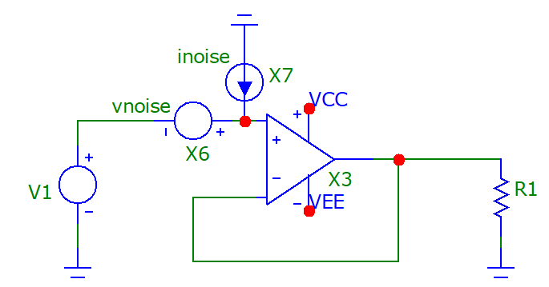
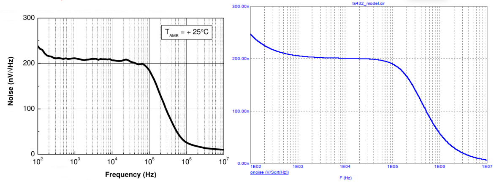
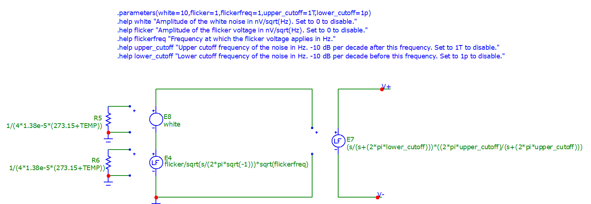
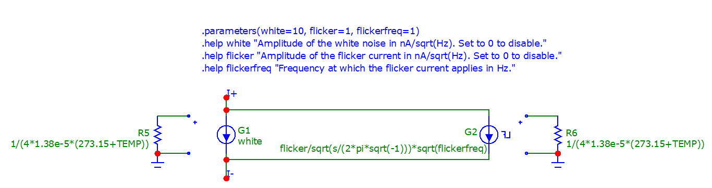

# Micro-Cap Noise Sources

A voltage and a current noise source for the AC noise analyses in [Micro-cap 12](https://archive.org/details/mc12cd_202110). It allows to inject white ($f^0$) and flicker ($f^{-1}$), shaped noise that is accurate to the real-life performance of devices. This enable very accurate noise simulations.

Inpsired by [Axotron's Blog post](http://axotron.se/blog/voltage-and-current-noise-sources-in-ltspice-noise-simulations/), and the [library for LTspice](https://github.com/yildi1337/LTspiceNoiseSources).

## Usage

A voltage and current noise source may be used to accurately replicate the input and output noise of devices. For instance, in the following picture, we simulate the input current and voltage noise in an op-amp.

There are 5 parameters (set by double-clicking the noise source):
* `white`: The amplitude of the white noise in $\mathrm{nV}/\sqrt{\mathrm{Hz}}$ or $\mathrm{nV}/\sqrt{\mathrm{Hz}}$. Set to 0 to disable the ($f^0$) component of the noise.
* `flicker`: The value of the flicker noise at `flickerfreq`, in $\mathrm{nV}/\sqrt{\mathrm{Hz}}$ or $\mathrm{nV}/\sqrt{\mathrm{Hz}}$. Set to 0 to disable the ($f^{-1}$) component of the noise.
* `flickerfreq`: The frequency at which the `flicker` amplitude is defined. For frequencies below and above `flickerfreq`, respectively, the flicker noise progresses with $-10~\mathrm{dB}/\mathrm{decade}$.
* `lower_cutoff` (vnoise only): lower cutoff frequency in Hz, below which the noise function decreases by $-10~\mathrm{dB}/\mathrm{decade}$. Can be disabled by setting a very low frequency, like 1p.
* `upper_cutoff` (vnoise only): upper cutoff frequency in Hz, above which the noise function decreases by $-10~\mathrm{dB}/\mathrm{decade}$. Can be disabled by setting a very high frequency, like 1T.

For instance, the plot on the left is from the datasheet of the TS432 voltage reference, and the plot on the right is the same noise characteristic replicated with the vnoise source of this repository.

Note: `white` is set to 200 ($\mathrm{nV}/\sqrt{\mathrm{Hz}}$), `flicker` at 250 ($\mathrm{nV}/\sqrt{\mathrm{Hz}}$) for `flickerfreq` of 100 (Hz). `upper_cutoff` is set to 300k (Hz) and `lower_cutoff` isn't used in this example.

Run a noise simulation by running an AC analysis (Alt+2) and then plotting either ONOISE (output noise) and/or INOISE (input noise) at the selected nodes, over the relevant bandwidth.

In other types of simulations (DC, Stability, Transient, etc.), the vnoise and inoise sources don't do anything so they can be kept in the circuit.

## Installation

1. Put the "LIBRARY/inoise.mac" and "LIBRARY/vnoise.mac" files in the "LIBRARY" folder at the installation location of Micro-Cap.
2. Put the "noise_source.cmp" file in the installation folder of Micro-Cap.
3. In Micro-Cap, menu "Windows" > "Component Editor..." > "Open" and select the "noise_source.cmp" file.

The noise sources are added to the usual components menu.

## Implementation

For the vnoise source, resistors are used in the simulation to generate some white noise. Their value is calculated from the Johnson–Nyquist equation to generate exactly 1 nV/SQRT Hz of white noise, regardless of the temperature of the simulation. The flicker noise goes through a Laplace transform to shape it to a $-10~\mathrm{dB}/\mathrm{decade}$ curve, while the white noise is simply multiplied by the amplitude.

Finally, another Laplace transform is used to generate a bandpass filter that can be use to shape the noise spectral density further.

The inoise source works in an identical manner, except that the bandpass filter is not implemented.

